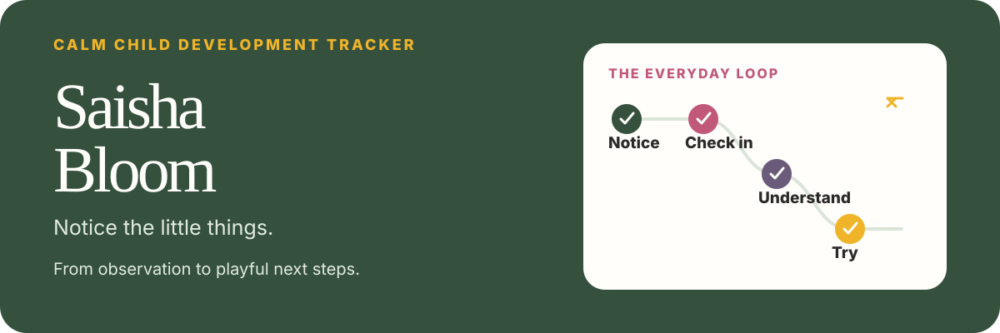
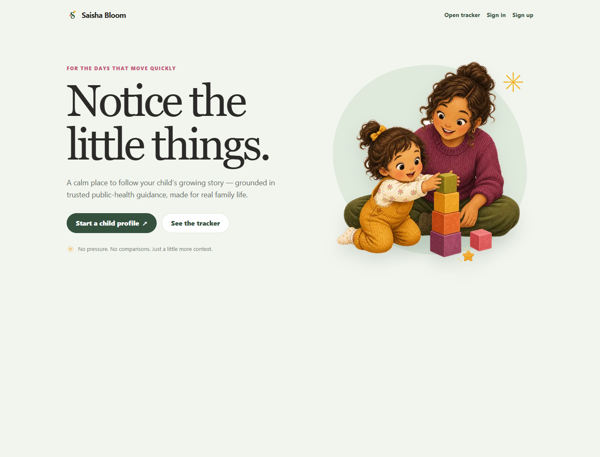
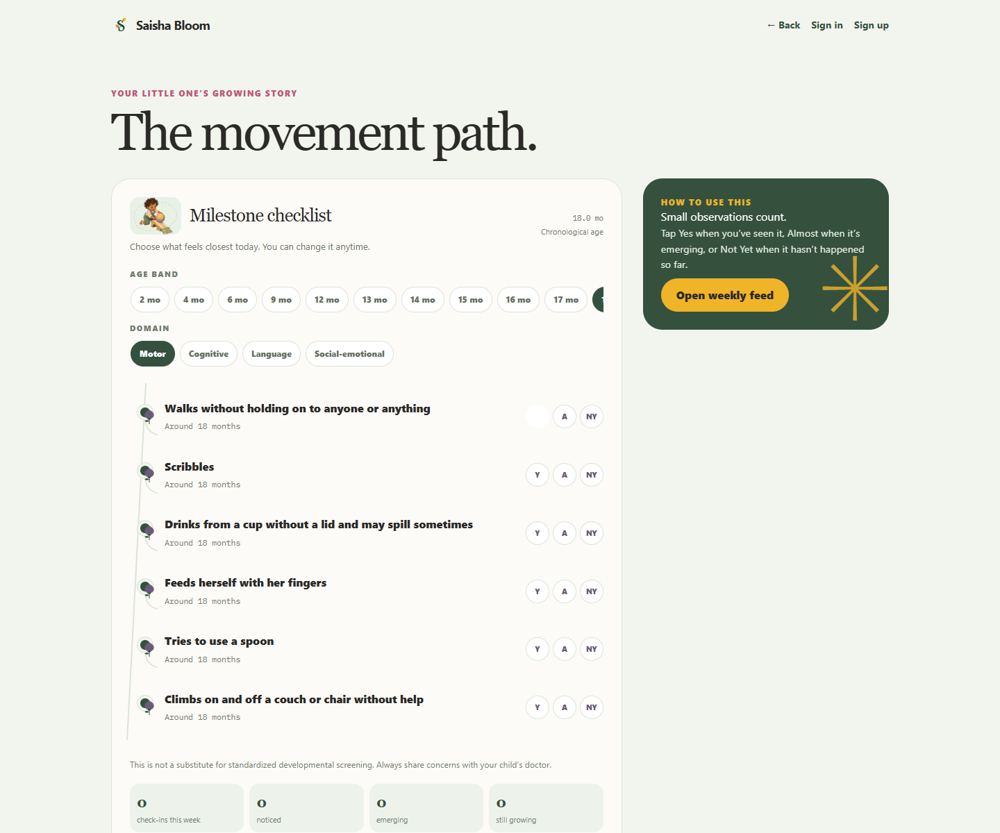
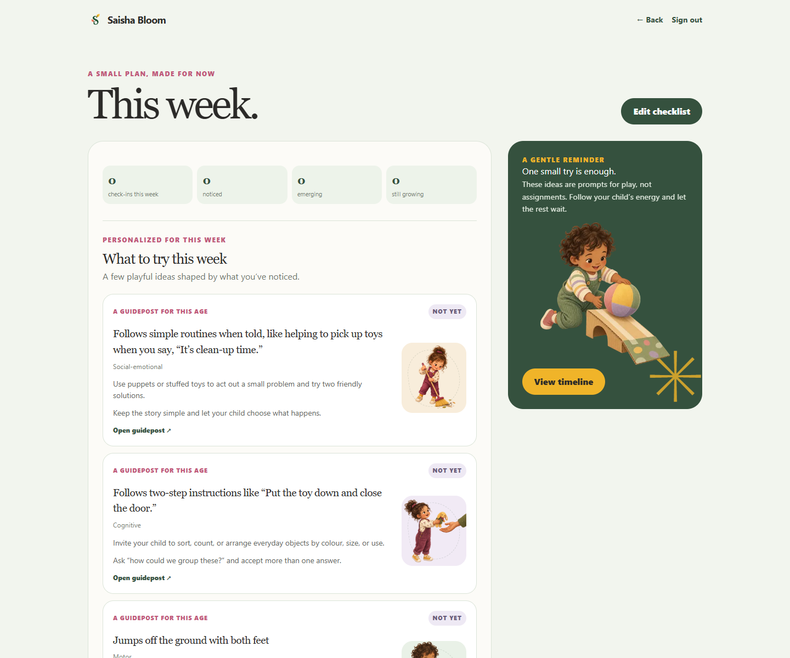
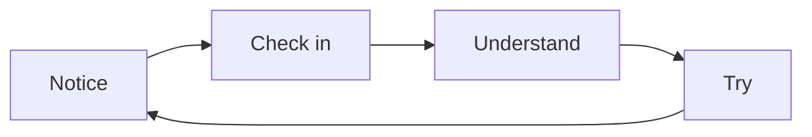

# Saisha Bloom

<p align="center">
  
</p>

<p align="center">
  <a href="https://saisha-bloom.vercel.app"><strong>Try Saisha Bloom ↗</strong></a>
  &nbsp;·&nbsp;
  <a href="https://saisha-bloom.vercel.app/child/demo/checklist">Open the public demo ↗</a>
</p>

<p align="center">
  <a href="https://saisha-bloom.vercel.app"></a>
  <a href="https://nextjs.org/"></a>
  <a href="https://react.dev/"></a>
  <a href="https://www.typescriptlang.org/"></a>
  <a href="https://supabase.com/"></a>
  <a href="https://www.prisma.io/"></a>
  <a href="https://tailwindcss.com/"></a>
  <a href="./LICENSE"></a>
</p>

> Notice the little things.

Saisha Bloom is a calm, source-led child-development tracker for parents and caregivers. It turns everyday observations into useful context, gentle activities, and a clearer story to bring to a child-health professional when needed.

## See it in action

The first screen is intentionally simple: understand the promise, see the product, then open the tracker.

<p align="center">
  
</p>

<table>
  <tr>
    <td width="50%" valign="top">
      <p><strong>Follow a milestone path</strong></p>
      
    </td>
    <td width="50%" valign="top">
      <p><strong>Find one small thing to try</strong></p>
      
    </td>
  </tr>
</table>

## A gentler loop



The central interaction is not pass or fail. Caregivers choose the state that feels closest today:

- **Yes** — you have noticed it.
- **Almost** — it is emerging.
- **Not yet** — it has not happened so far.

## What lives inside

| Guideposts | Everyday context |
| --- | --- |
| Four CDC domains: motor, cognitive, language, and social-emotional | Age-aware navigation from 2 months through 4 years |
| Source links kept beside the milestone content | Short, reviewed activity ideas shaped by what you notice |
| Weekly progress without streaks, rankings, or pressure | A timeline for observations, notes, and optional memory photos |
| Broad age-only growth references | Authenticated family space with optional caregiver invites |

## Built around real family life

The visual language is warm and editorial, but the content stays practical. These are the project’s own activity illustrations—not generic stock decoration.

<table>
  <tr>
    <td align="center"><br><sub>Explore &amp; build</sub></td>
    <td align="center"><br><sub>Talk &amp; connect</sub></td>
    <td align="center"><br><sub>Move &amp; climb</sub></td>
  </tr>
  <tr>
    <td align="center"><br><sub>Practice routines</sub></td>
    <td align="center"><br><sub>Make &amp; express</sub></td>
    <td align="center"><br><sub>Play together</sub></td>
  </tr>
</table>

## Why it exists

Development is not a race. Saisha Bloom helps a caregiver answer three small questions without turning them into a score:

1. **What might be relevant around this age?**
2. **What have I noticed in everyday life?**
3. **What could we try next through normal play?**

The experience is deliberately non-diagnostic. A missing milestone should lead to context and a possible conversation with a pediatrician—not a conclusion.

## Run locally

```bash
npm install
npm run supabase:start
npm run db:generate
npm run db:migrate
npm run db:seed
npm run dev
```

Then open:

- `http://localhost:3000` for the landing page
- `http://localhost:3000/child/demo/checklist` for the public demo tracker

Copy `.env.example` to `.env` and set `DATABASE_URL`, the direct non-pooler `DIRECT_URL`, `NEXT_PUBLIC_SUPABASE_URL`, `NEXT_PUBLIC_SUPABASE_PUBLISHABLE_KEY`, and the server-only `SUPABASE_SECRET_KEY`. For email invites, reminders, and deletion-failure alerts, also set `NEXT_PUBLIC_SITE_URL`, `RESEND_API_KEY`, `REMINDER_FROM_EMAIL`, `PRIVACY_CONTACT_EMAIL`, and a 32+ character `CRON_SECRET`. Vercel calls `/api/reminders/daily` once per day using that secret. To enable Web Push, set `NEXT_PUBLIC_VAPID_PUBLIC_KEY`, `VAPID_PRIVATE_KEY`, and `VAPID_SUBJECT` together. Public custom analytics remain off unless both `NEXT_PUBLIC_PRIVACY_COPY_APPROVED` and `NEXT_PUBLIC_ANALYTICS_EVENTS_ENABLED` are explicitly `true`.

Local Supabase uses ports `54421–54429`. Keep the `milestone-memories` bucket private. Use `npm run db:migrate` for deployed databases; do not use `db:push` in production.

## Verify the project

```bash
npm run typecheck
npm test
npm run build
```

## Source-led by design

Milestone guideposts come from CDC data. Reviewed activity and care-seeking guidance is stored separately in `prisma/seed-data/guidance.json`, with references to AAP, ZERO TO THREE, NHS Start for Life, Raising Children Network, and India’s RBSK.

The CDC scraper writes only `prisma/seed-data/cdc-milestones-candidate.json`, which is ignored by Git. Run `npm run content:cdc:diff`, review every change, then explicitly approve with `npm run content:cdc:approve -- --approve --reviewer="Name" --reviewed-at=YYYY-MM-DD`. Approved content replaces `cdc-milestones-raw.json` and records a review manifest. Exact reviewed neutral wording lives separately in `cdc-neutral-overrides.json`. WHO motor windows and conservative CDC checkpoint intervals live in `emergence-windows.json` and are upserted by `npm run db:seed`.

## Boundaries that matter

Saisha Bloom is not a diagnostic product, medical screening tool, percentile calculator, or replacement for a pediatrician. Growth references are broad, age-only context; they do not diagnose or define a child’s development.

Authenticated child data is protected through Supabase auth and server-side access checks. The latest database migration enables row-level security on Prisma tables.

## Stack

Next.js · React · TypeScript · Prisma · Supabase · Tailwind CSS

**Current stage:** Working MVP / product foundation

## Made for everyone

Saisha Bloom was created by **Sourav Deb** and is made for everyone. You are welcome to use it, learn from it, and improve it under the [MIT License](./LICENSE).

To modify the project, create a fork on GitHub, make your changes in your fork, and open a pull request when you are ready to share them.

## License

This project is available under the [MIT License](./LICENSE).
