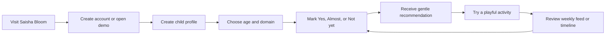

# Saisha Bloom — Master Product Requirements Document

## 1. Product definition

**Product name:** Saisha Bloom  
**Product type:** Calm child-development milestone tracker  
**Current stage:** Working MVP / product foundation  
**Primary platform:** Responsive web application  
**Primary audience:** Parents and caregivers of children aged 2 months to 4 years

Saisha Bloom helps caregivers notice developmental progress without pressure, comparison, or premature conclusions.

The product combines:

- Trusted developmental milestone guideposts
- Simple observation check-ins
- Age- and domain-based navigation
- Gentle, play-oriented recommendations
- Weekly progress summaries
- A personal development timeline
- Broad, non-diagnostic growth references

Its central promise is:

> Notice the little things.

Saisha Bloom is explicitly not a diagnostic product, medical screening tool, percentile calculator, or replacement for a pediatrician.

## 2. Product vision

Saisha Bloom should become a trusted family space where caregivers can:

1. Understand what developmental changes may be relevant now.
2. Record what they have noticed in everyday life.
3. Receive practical activities that fit naturally into play and routines.
4. Recognize progress without treating development as a race.
5. Bring clearer observations and questions to a child-health professional.

The product’s emotional goal is reassurance and useful context—not achievement pressure.

## 3. Product principles

### Gentle over gamified

The experience avoids streaks, leaderboards, rankings, badges, competitive scores, and deadline language.

### Observe over judge

The primary interaction is not “pass” or “fail.” It is:

- Yes
- Almost
- Not yet

### Source-led over speculative

Milestones are based on public-health and developmental sources. Recommendations are short, reviewed, and practical.

### Personalized over generic

The experience uses:

- Child name
- Date of birth
- Age
- Selected developmental domain
- Previous observations
- Child pronouns
- Optional growth entries

### Supportive over clinical

The interface uses language such as:

- “A lovely step forward”
- “Almost there is still progress”
- “There is time to grow into this”
- “Worth mentioning at your next visit”

### Minimal data collection

The profile asks for only:

- First name
- Date of birth
- Gender/pronouns
- Optional gestational weeks
- Optional height/length
- Optional weight

### Safety before certainty

A missing milestone should produce context and suggested follow-up—not a diagnosis.

## 4. Target users

### Primary user: Parent or caregiver

A parent, guardian, or family member wants a simple way to understand what they are noticing without spending hours researching developmental information.

Typical needs:

- “What should I look for around this age?”
- “Is this emerging or not yet?”
- “What can we try during normal play?”
- “What should I mention at our next visit?”
- “Can I see what I have already noticed?”

### Secondary user: Family care team conversation

Saisha Bloom does not provide a clinician portal in the current implementation. However, its timeline and observation history are designed to help caregivers have more specific conversations with pediatricians or other child-health professionals.

### Internal user: Content steward

The content system also assumes an internal maintainer who:

- Reviews source data
- Re-runs the CDC ingestion process when needed
- Checks for source changes
- Maintains activity guidance
- Keeps safety language accurate

## 5. Core user journey

The intended product loop is:

> Observe → Check in → Understand → Try → Notice again → Discuss when needed

## 6. Goals

### MVP goals

1. Provide a calm, polished family-facing milestone experience.
2. Cover the four CDC developmental domains.
3. Support milestone navigation from 2 through 48 months.
4. Allow a caregiver to record simple observations.
5. Generate useful activity suggestions from those observations.
6. Show weekly progress without turning it into a performance score.
7. Provide a readable timeline of recorded milestones.
8. Preserve source and safety context.
9. Protect authenticated child data.
10. Work as a public demo without requiring account creation.

### Non-goals

The current product does not attempt to provide:

- A developmental diagnosis
- A standardized developmental screening assessment
- Medical advice
- Growth-chart percentiles
- A clinical referral workflow
- Social comparison with other children
- Caregiver-to-caregiver sharing
- Clinician accounts
- Notifications or reminders
- In-app messaging
- Photo or video journaling
- AI-generated medical conclusions
- A full multi-child management dashboard
- Formal account deletion, export, or data-retention management

## 7. Route and experience map

| Route | Purpose | Access |
|---|---|---|
| `/` | Public landing page and product introduction | Public |
| `/sign-in` | Email/password sign-in | Public |
| `/sign-up` | Account creation | Public |
| `/onboarding` | Create a child profile | Authenticated when Supabase is configured |
| `/dashboard` | Family overview and current path | Protected when Supabase is configured |
| `/child/demo/checklist` | Public interactive demo tracker | Public |
| `/child/:id/checklist` | Milestone checklist and check-ins | Protected except demo |
| `/child/:id/feed` | Weekly activity recommendations | Protected except demo |
| `/child/:id/milestone/:milestoneId` | Detailed milestone and activity guide | Protected except demo |
| `/child/:id/timeline` | Recorded observation timeline | Protected except demo |

The application uses server-rendered dynamic pages for authenticated child data and a static public landing experience.

## 8. Functional requirements

### FR-01 — Public landing page

The landing page must communicate the product’s emotional and functional promise immediately.

Current behavior:

- Saisha Bloom logo and wordmark
- “Notice the little things.” headline
- Calm, non-judgmental supporting copy
- Primary CTA: “Start a child profile”
- Secondary CTA: “See the tracker”
- Public hero illustration
- “No pressure. No comparisons.” reassurance

Acceptance criteria:

- A first-time visitor understands that the product tracks child development.
- The user can start onboarding without searching for navigation.
- The user can open the demo tracker without creating an account.
- The page remains usable on mobile widths.

### FR-02 — Authentication and privacy

When Supabase configuration is present:

- `/dashboard` requires authentication.
- `/child/*` routes require authentication, except `/child/demo`.
- Unauthenticated users are redirected to sign-in.
- Email/password sign-in is supported.
- Email/password account creation is supported.
- Users can sign out from the header.
- Child access is checked against the authenticated application user.

When Supabase is not configured:

- The public demo remains usable.
- Onboarding can use a local/demo account flow if the database is available.

Acceptance criteria:

- An unauthenticated visitor cannot access another user’s child profile.
- A user can sign in and return to the requested destination.
- Sign-out returns the user to the landing page.
- Authentication failures are surfaced to the user.

Current limitation:

- There is no password-reset flow.
- Formal account deletion, data export, retention, and consent management are not implemented.

### FR-03 — Child onboarding

The onboarding form creates a private child profile.

Required fields:

- Child’s first name
- Date of birth
- Gender/pronoun selection

Optional fields:

- Gestational weeks
- Current length/height in centimeters
- Current weight in kilograms

Current validation ranges:

- Gestational weeks: 20–45
- Height: 30–140 cm
- Weight: 1–45 kg

Acceptance criteria:

- Invalid or missing required values are rejected.
- A valid profile is saved to the authenticated user.
- After successful creation, the user is sent to the child checklist.
- Optional values can be omitted.

Important product issue:

The interface says gestational weeks can support corrected-age details, but the current age calculation uses chronological age only. Corrected age is stored but not yet applied to milestone filtering or growth references.

### FR-04 — Milestone library

The tracker uses four developmental domains:

- Motor
- Cognitive
- Language
- Social-emotional

The current application exposes CDC milestone data from:

- 2 months
- 4 months
- 6 months
- 9 months
- 12 months
- 15 months
- 18 months
- 24 months
- 30 months
- 36 months
- 48 months

The UI exposes every month from 12 through 48. Months between CDC checkpoints use the closest earlier CDC guidepost.

Example:

- Selecting 20 months displays the 18-month source checkpoint.
- The interface explains that it is showing the closest guidepost.

Current checked-in data:

- 143 CDC milestones are exposed to the application.
- The raw CDC file contains 158 records through 60 months.
- The application intentionally filters the active tracker to 48 months.
- The four domain counts in the active set are approximately:
  - Motor: 41
  - Cognitive: 27
  - Language: 36
  - Social-emotional: 39

Acceptance criteria:

- Every active milestone has a domain, age, source, and source URL.
- The user can filter by age and domain.
- The app does not invent missing checkpoint wording.
- Source changes can be reviewed before reseeding production data.

Current limitation:

The source URL exists in the data model but is not yet visibly exposed as a user-facing citation on milestone screens.

### FR-05 — Checklist navigation

The checklist must allow a caregiver to:

- Select an age band
- Select a developmental domain
- Read milestone guideposts
- Mark an observation status
- Open milestone detail
- Open the weekly feed

The default domain is Motor.

The checklist uses an adaptive path:

- If all visible milestones in the current domain are marked Yes or Almost, the path advances to the next source checkpoint.
- If any milestone remains Not yet, the user stays on the current checkpoint.
- A notice explains when answers move the path forward.

Acceptance criteria:

- Changing domains resets the relevant path position appropriately.
- Current answers remain available while navigating.
- The user can manually select another age.
- The interface explains when an exact month is represented by an earlier source checkpoint.

### FR-06 — Observation statuses

Each milestone supports three statuses:

| Status | Meaning | Bloom state |
|---|---|---|
| Yes | The caregiver has observed the skill | Fully open green bloom |
| Almost | The skill appears to be emerging | Partially open pink bloom |
| Not yet | The skill has not been observed so far | Closed purple bloom |

The interface uses compact status buttons:

- Y
- A
- NY

The buttons include full accessible labels.

Acceptance criteria:

- Selecting a status updates the interface immediately.
- The selected status is visually clear.
- Status updates are saved for authenticated child profiles.
- Demo mode does not require persistence.
- Status changes do not create diagnostic labels.

Current implementation detail:

Responses are stored as new `MilestoneResponse` records. The latest response is used when rendering the current checklist state.

Current limitation:

The schema includes a note field, but there is no user interface for adding an observation note.

### FR-07 — Recommendation engine

Recommendations depend on:

- Milestone
- Status
- Child age
- Developmental domain
- Available guidance content

Current status messaging:

- Yes: celebrates progress and suggests continuing naturally.
- Almost: encourages low-pressure practice.
- Not yet within the expected window: reassures the caregiver that there is time.
- Not yet beyond the milestone’s maximum window: suggests mentioning it at a future care visit.

Acceptance criteria:

- Recommendations never present a milestone as a pass/fail medical result.
- Recommendations include practical language.
- Activities encourage supervision and following the child’s lead.
- Past-window messaging includes a care-team suggestion.
- The content fallback remains safe when no specific activity exists.

### FR-08 — Weekly feed

The weekly feed provides up to five recommendations.

Feed behavior:

- Uses the child’s current age and source checkpoint.
- Prioritizes “Almost” observations.
- Then prioritizes “Not yet.”
- Then shows “Yes” items.
- Uses unaddressed guideposts as a final fallback.
- Displays the reason for each recommendation.
- Links to the full milestone guide.

Example reasons:

- “Keep exploring this one”
- “A gentle next step”
- “A moment worth celebrating”
- “A guidepost for this age”

Acceptance criteria:

- The feed always remains age-relevant.
- The feed never overwhelms the user with a large task list.
- Each item has a clear activity and next step.
- The feed can be opened from the dashboard and checklist.

### FR-09 — Milestone detail page

Each milestone detail page must provide:

- Bloom status
- Age range or checkpoint
- Developmental domain
- Milestone title
- Supportive explanation
- Status-aware recommendation
- Activity title
- Activity instructions
- Practical tip
- Frequency
- Benefits
- Materials required
- Relevant illustration

Acceptance criteria:

- The page clearly distinguishes a guidepost from a diagnosis.
- The activity can be completed using ordinary household materials where possible.
- Safety notes are included for activities involving food, climbing, or movement.
- The user can return to the checklist.

### FR-10 — Weekly progress

Weekly progress summarizes check-ins from the current week.

Current metrics:

- Total check-ins
- Noticed
- Emerging
- Still growing

The week begins on Monday.

Acceptance criteria:

- Progress is understandable without interpreting it as a score.
- The counts reflect the user’s current week.
- The summary appears on the checklist and weekly feed experience.
- The interface remains useful when no check-ins exist.

Known consideration:

Because response records are append-only, repeated updates to the same milestone can affect persisted weekly totals. The desired definition of a “check-in” versus a “unique milestone observed this week” should be finalized.

### FR-11 — Timeline

The timeline provides a record of milestones the caregiver has noted.

Current behavior:

- Shows the child’s name.
- Shows the number of milestones currently noted.
- Displays the latest status for each answered milestone.
- Shows the date of the latest response.
- Uses Indian date formatting.
- Provides an empty state when no observations exist.

Acceptance criteria:

- The timeline is chronological and readable.
- The user can distinguish Yes, Almost, and Not yet.
- Empty states explain how to begin.
- The timeline reinforces that observations are part of a growing story.

Current limitation:

The database stores multiple response rows, but the current timeline renders the latest response per milestone rather than a complete history of every status change.

### FR-12 — Growth reference

For children aged 12–48 months, the dashboard can display a broad age-only reference for:

- Length/height
- Weight

The reference:

- Uses a fixed lookup table.
- Displays a broad range rather than a percentile.
- Shows the latest entered height and weight when available.
- Explains that a single measurement is less useful than a growth trend.
- States that it is not a diagnosis.

Acceptance criteria:

- Growth information cannot be mistaken for a clinical assessment.
- Children under 12 months do not receive an inappropriate age-only reference.
- Height and weight remain optional.
- The UI explains the distinction between length and standing height for younger children.

Current limitation:

There is no longitudinal growth chart, sex-specific LMS calculation, trend view, or clinician-facing interpretation.

## 9. Content and trust model

### Primary milestone source

CDC Learn the Signs. Act Early.

The scraper:

- Fetches CDC checkpoint pages.
- Maps content into structured age/domain records.
- Writes reviewed JSON to the seed-data directory.
- Warns when a page returns zero milestones.
- Requires manual review before production seeding.

### Additional reference source

WHO motor-development data is included for seed/reference purposes.

The checked-in WHO dataset contains six motor-development windows:

- Sitting without support
- Standing with assistance
- Hands-and-knees crawling
- Walking with assistance
- Standing alone
- Walking alone

These records are not the primary active checklist source. The active database query uses CDC milestones for the tracker.

### Guidance sources

The current guidance library contains 27 reviewed records:

- 19 activity entries
- 4 evidence entries
- 4 care-seeking entries

Sources include:

- American Academy of Pediatrics
- ZERO TO THREE
- NHS Start for Life
- Raising Children Network
- Rashtriya Bal Swasthya Karyakram

Guidance is independently paraphrased and stores:

- External ID
- Title
- Summary
- Domain
- Age range
- Content kind
- Source name
- Source URL
- Review date

### Content governance requirements

Before production expansion:

1. Review every source record manually.
2. Preserve canonical source URLs.
3. Track review dates.
4. Re-run the CDC scraper periodically.
5. Diff new output against existing content.
6. Never silently replace source language after a markup change.
7. Keep medical and safety claims conservative.
8. Review activity instructions involving food, climbing, choking, falls, and supervision.
9. Make source attribution visible to users.

## 10. Data model

| Entity | Purpose |
|---|---|
| `User` | Application account associated with an authenticated email |
| `Child` | Private child profile owned by a user |
| `Milestone` | Source-backed developmental guidepost |
| `MilestoneResponse` | Observation status recorded for a child and milestone |
| `Recommendation` | Schema support for persisted recommendation content |
| `Guidance` | Reviewed external activity, evidence, and care-seeking content |

### Child data

Current child fields include:

- Name
- Date of birth
- Gender
- Gestational weeks
- Height
- Weight
- Creation date
- Owning user

### Response data

Current response fields include:

- Child ID
- Milestone ID
- Status
- Optional note field
- Creation date

The note field is not currently exposed in the interface.

### Runtime recommendation behavior

Although a `Recommendation` database model exists, current recommendation generation is primarily code-driven through:

- `lib/recommendation.ts`
- `lib/activity-bank.ts`
- `lib/weekly-feed.ts`

This keeps the MVP simple but means editorial recommendation updates require a code/content deployment unless the persisted recommendation model is adopted later.

## 11. Brand and design requirements

### Visual direction

Saisha Bloom uses a soft editorial visual language:

- Pale sprig background
- Moss green for trust and progress
- Berry pink for warmth and emerging growth
- Golden yellow for optimism and emphasis
- Dusky purple for “Not yet”
- Warm white cards
- Rounded panels
- Serif display typography
- Sans-serif interface typography
- Botanical bloom status illustrations
- Gentle illustrated activity scenes

### Key brand metaphor

The bloom represents developmental progress:

- Closed bloom: not yet observed
- Emerging bloom: almost
- Open bloom: noticed

### Interaction design

- Large, clear tap targets
- Pill-shaped age and domain filters
- Circular status controls
- Strong focus-visible outlines
- Accessible labels for compact controls
- Reduced-motion support
- Responsive layouts for mobile and desktop
- Mobile stacking of panels and illustrations

### Tone requirements

Copy should be:

- Warm
- Clear
- Short
- Non-judgmental
- Practical
- Parent-friendly
- Free of clinical overstatement

Avoid:

- “Failed”
- “Abnormal”
- “Behind”
- “Normal child”
- “Guaranteed”
- “This means your child has…”

## 12. Technical baseline

Current implementation uses:

- Next.js 15 App Router
- React 19
- TypeScript with strict checking
- Prisma 6
- PostgreSQL
- Supabase Auth and SSR session handling
- Tailwind configuration
- Custom global CSS
- Local static image assets
- Server actions for profile creation and response saving

Important architectural characteristics:

- Authenticated pages are dynamically rendered.
- Child queries verify ownership.
- Demo routes intentionally bypass authentication.
- Database failures fall back to demo data in some read paths.
- No external AI service is required.
- No additional runtime dependency is required for recommendation generation.

## 13. Non-functional requirements

### Privacy

- Child records must be scoped to the authenticated user.
- No child profile should be publicly enumerable.
- Sensitive configuration must remain in environment variables.
- The product must clearly explain what data is collected.
- Account deletion and data export should be added before broad production release.

### Accessibility

- Keyboard focus must remain visible.
- Status buttons must have descriptive labels.
- Decorative images must not add noise to screen readers.
- Semantic headings must remain ordered.
- The product must remain usable at mobile widths.
- Reduced-motion preferences must be respected.

### Performance

- Public landing page should remain lightweight.
- Images should use responsive sizing.
- Dynamic database pages should avoid unnecessary queries.
- Weekly feed generation should remain deterministic and fast.
- Content should be pre-reviewed rather than generated at request time.

### Reliability

- Save failures should be visible to the user.
- The interface should distinguish optimistic local state from confirmed persisted state.
- Duplicate response behavior should be defined.
- Database fallback behavior should not silently show demo data inside an authenticated account.

## 14. Success metrics

Analytics are not currently implemented. Recommended future metrics:

### Activation

- Landing-page-to-onboarding conversion
- Onboarding completion rate
- Time to first child profile
- Time to first milestone check-in

### Engagement

- Check-ins per active family per week
- Weekly feed opens
- Milestone-detail opens
- Timeline views
- Return visits within 7 and 30 days

### Product usefulness

- Percentage of users who mark at least one item Almost
- Activity-guide click-through rate
- Repeated use of the weekly feed
- Caregiver-reported usefulness of recommendations

### Trust and safety

- Source citation coverage
- Safety-content review completion
- Rate of reported confusing or alarming language
- Authentication and authorization error rate
- Failed-save rate

The product should optimize for returning families and useful reflection—not maximum check-in volume.

## 15. Key risks and unresolved decisions

### P0 — Corrected-age behavior

Gestational weeks are collected and stored, but chronological age is currently used everywhere. The product must either:

- Implement corrected-age logic; or
- Remove the promise that gestational age affects the tracker.

### P0 — Gender and pronoun model

The current onboarding requires Girl or Boy and uses those values for pronoun replacement. A production version should decide whether to:

- Keep gender as an explicit product input;
- Collect pronouns separately;
- Make the field optional;
- Add inclusive options;
- Stop rewriting source milestone wording.

### P0 — Source visibility

Source metadata exists internally, but caregivers do not currently see direct source links on the milestone experience. Trust would improve through visible “Source” links and review dates.

### P0 — Privacy controls

Before production launch, define:

- Privacy policy
- Data retention
- Account deletion
- Child-profile deletion
- Data export
- Consent language
- Breach response
- Database backup and recovery expectations

### P1 — Multiple children

The schema supports multiple child profiles, but the current dashboard selects the earliest-created child and has no profile switcher.

### P1 — Observation notes

The database has a note field, but caregivers cannot currently explain when, where, or how they observed a milestone.

### P1 — Complete timeline history

The product should decide whether the timeline represents:

- The current latest status per milestone; or
- Every observation event over time.

### P1 — Error feedback

Onboarding and response-save failures should be rendered directly in the interface instead of failing silently or relying on a generic fallback.

### P1 — Testing and analytics

The project currently has no first-party test/spec files. A production release should add focused coverage for:

- Age-band selection
- Adaptive path progression
- Status persistence
- Ownership checks
- Recommendation tone
- Weekly feed ordering
- Growth-reference boundaries
- Demo-mode behavior

## 16. Recommended release phases

### Phase 1 — Current MVP foundation

Already implemented:

- Public landing page
- Demo checklist
- Account creation and sign-in
- Child onboarding
- CDC milestone library
- Four developmental domains
- Age and domain filters
- Yes/Almost/Not yet statuses
- Bloom visual language
- Recommendations
- Weekly feed
- Timeline
- Growth reference
- Responsive and accessible visual foundation

### Phase 2 — Trust and production readiness

Recommended next:

- Visible source citations
- Corrected-age decision and implementation
- Inclusive profile/pronoun model
- Explicit save-error states
- Privacy policy and account controls
- Child profile editing
- Child profile deletion
- Focused automated tests
- Formal content review workflow

### Phase 3 — Family utility

Potential later additions:

- Multiple-child switcher
- Observation notes
- Full historical timeline
- Exportable caregiver summary
- Optional reminders
- Care-team sharing with explicit consent
- Localized language support
- Region-aware care resources

These should only be added if they reinforce the core observation-and-context loop.

## 17. MVP definition of done

Saisha Bloom is ready for a controlled MVP release when:

- A caregiver can discover the product without explanation.
- A caregiver can create a profile and reach the checklist.
- Milestones are source-backed and age-relevant.
- A caregiver can record Yes, Almost, or Not yet.
- Saved responses survive refresh for authenticated users.
- Recommendations remain supportive and non-diagnostic.
- Weekly feed items are limited, relevant, and actionable.
- Timeline data is understandable.
- Growth references are clearly labelled as broad, non-diagnostic context.
- Child data is protected by authentication and ownership checks.
- Source links and content review state are visible.
- Save failures are shown clearly.
- Corrected-age behavior is either implemented or removed from the promise.
- Type checking, production build, and focused tests pass.

## 18. Current implementation verification

As of the current workspace review:

- TypeScript type checking passes.
- The Next.js production build passes.
- The application exposes the expected public and authenticated routes.
- No product files were modified during the review that produced this document.

Implementation references:

- [README.md](../README.md)
- [Landing page](../app/page.tsx)
- [Checklist experience](../components/Checklist.tsx)
- [Recommendation logic](../lib/recommendation.ts)
- [Database schema](../prisma/schema.prisma)
- [Guidance content](../prisma/seed-data/guidance.json)
